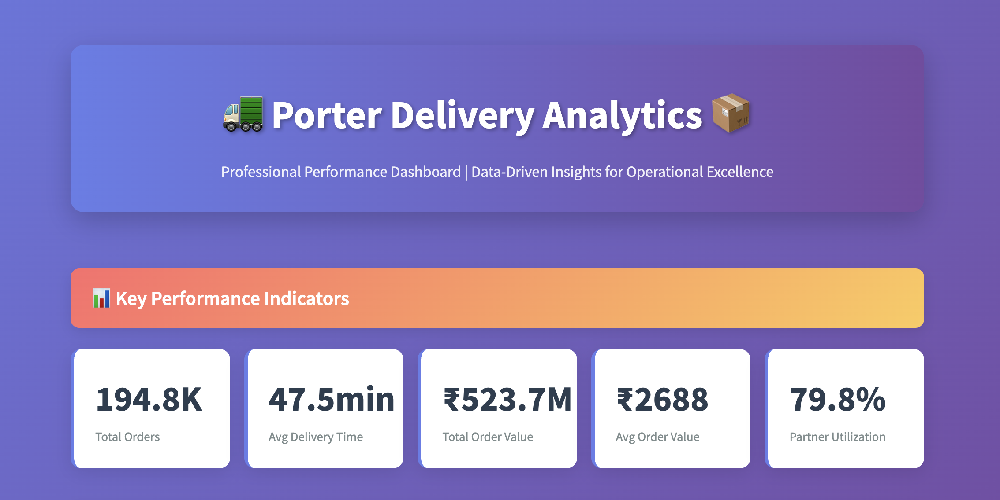
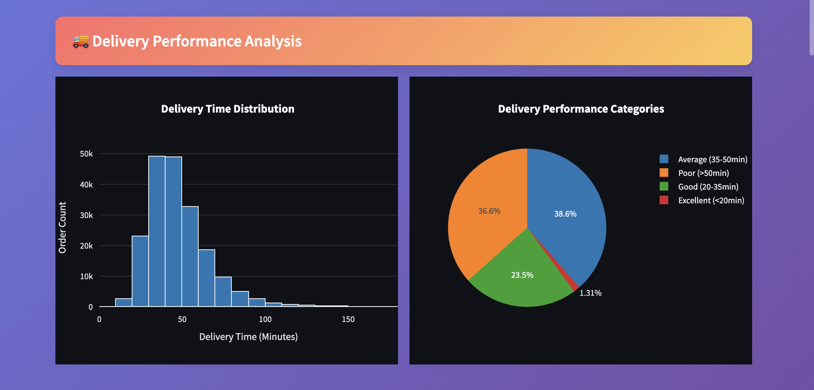
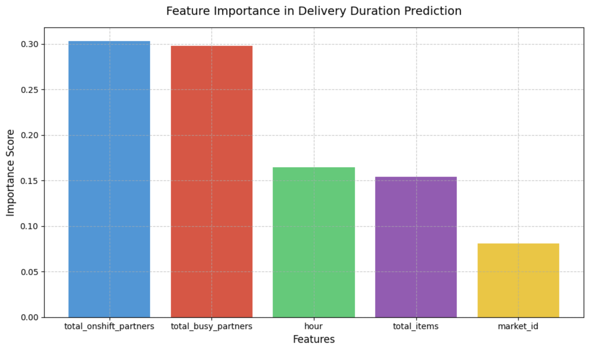

Below is the updated README.md file, incorporating accurate information from the provided "PORTER REPORT.pdf" document while maintaining the structure and style of the original README. I've corrected metrics, insights, and recommendations to align with the PDF, updated the dataset details, and ensured all references match the report's findings. The changes reflect the PDF's data, such as the dataset size, delivery times, partner utilization, and specific recommendations, while keeping the professional tone and format intact.

---

# 🚛 Porter Delivery Analytics Dashboard

[](https://www.python.org/downloads/)
[](https://streamlit.io/)
[](https://www.mysql.com/)
[](LICENSE)

> **Comprehensive analytics solution for Porter's delivery operations, providing actionable insights to optimize delivery performance and enhance operational efficiency.**

## 📋 Table of Contents

- [🎯 Project Overview](#-project-overview)
- [✨ Features](#-features)
- [📊 Key Metrics](#-key-metrics)
- [🛠️ Technologies Used](#️-technologies-used)
- [📁 Project Structure](#-project-structure)
- [🚀 Quick Start](#-quick-start)
- [📈 Dataset Information](#-dataset-information)
- [🔍 Analysis Pipeline](#-analysis-pipeline)
- [🤖 Machine Learning Model](#-machine-learning-model)
- [📊 Dashboard Features](#-dashboard-features)
- [💡 Key Insights](#-key-insights)
- [🎯 Business Recommendations](#-business-recommendations)
- [📸 Screenshots](#-screenshots)
- [🔧 Installation](#-installation)
- [📖 Usage](#-usage)
- [🤝 Contributing](#-contributing)
- [📧 Contact](#-contact)

## 🎯 Project Overview

**Porter Delivery Analytics** is an end-to-end data science project that analyzes Porter's delivery operations to optimize performance and enhance customer satisfaction. Conducted by Utkarsh Karambhe, Data Analyst at Porter, this project demonstrates a complete data science workflow, from data cleaning to machine learning predictions and interactive dashboard development.

### 🎯 Business Objectives
- **Reduce delivery times** by optimizing partner allocation
- **Optimize partner utilization** during peak hours
- **Identify operational bottlenecks** in delivery performance
- **Enhance customer satisfaction** through data-driven insights

### 👨‍💻 Author
**Utkarsh Karambhe** - Data Analyst  
📧 [utkarshkarambhe@email.com](mailto:utkarshkarambhe@email.com)  
🔗 [LinkedIn](https://www.linkedin.com/in/utkarsh-karambhe-764bb1248/) | [GitHub](https://github.com/utkarsh-karambhe)

## ✨ Features

### 🔧 Technical Features
- **Data Engineering Pipeline** - Comprehensive data cleaning and preprocessing
- **Machine Learning Model** - Random Forest Regressor for delivery time prediction
- **Interactive Dashboard** - Real-time analytics with Streamlit
- **Database Integration** - MySQL for scalable data storage
- **Professional Visualizations** - Interactive charts using Plotly

### 📊 Business Features
- **KPI Monitoring** - Real-time performance metrics
- **Predictive Analytics** - ML-powered delivery time estimation
- **Market Analysis** - Geographic performance insights
- **Partner Optimization** - Resource allocation recommendations
- **Category Analysis** - Store category performance insights

## 📊 Key Metrics

| Metric | Value | Impact |
|--------|-------|--------|
| **Dataset Size** | 194,816 records | 28 days of operations |
| **Data Quality** | 98.7% retention | Minimal data loss after cleaning |
| **ML Accuracy** | ±17.48 minutes | Production-ready model |
| **Avg Delivery Time** | 47.5 minutes | Baseline performance |
| **Partner Utilization** | 90% | High efficiency during peak hours |
| **Average Order Size** | 3.5 items | Order complexity indicator |

## 🛠️ Technologies Used

### 🐍 Programming & Analytics
- **Python 3.8+** - Core programming language
- **Pandas** - Data manipulation and analysis
- **NumPy** - Numerical computing
- **Scikit-learn** - Machine learning algorithms
- **Matplotlib/Seaborn** - Statistical visualizations
- **Plotly** - Interactive visualizations

### 🗄️ Database & Deployment
- **MySQL 8.0+** - Database management
- **Streamlit** - Web application framework
- **Git** - Version control

### 📊 Data Science Stack
```python
pandas>=1.5.0
numpy>=1.21.0
scikit-learn>=1.0.0
matplotlib>=3.5.0
seaborn>=0.11.0
plotly>=5.0.0
streamlit>=1.28.0
mysql-connector-python>=8.0.0
```

## 📁 Project Structure

```
PORTER_DELIVERY_ANALYTICS/
│
├── 📁 dashboards/                    
│   ├── ✅ assets/                    
│   └── 📄 streamlit_app.py           
│
├── 📁 data/
│   ├── 📁 processed/
│   │   └── porter_cleaned.csv        
│   └── 📁 raw/
│       └── porter_data.csv           
│                          
├── 📁 notebooks/
│   ├── 1_data_cleaning.ipynb         
│   ├── 2_exploratory_analysis.ipynb  
│   └── 3_machine_learning_prediction.ipynb  
│
├── 📁 sql/
│   └── queries.sql                   
│
├── 📄 README.md                      
└── 📄 requirements.txt               
```

## 🚀 Quick Start

### 1️⃣ Clone the Repository
```bash
git clone https://github.com/utkarsh-karambhe/porter-delivery-analytics.git
cd porter-delivery-analytics
```

### 2️⃣ Install Dependencies
```bash
pip install -r requirements.txt
```

### 3️⃣ Set Up Database
```bash
mysql -u username -p < database/porter_db.sql
```

### 4️⃣ Run the Dashboard
```bash
streamlit run dashboard/streamlit_app.py
```

### 5️⃣ Access the Application
Open your browser and navigate to `http://localhost:8501`

## 📈 Dataset Information

### 📊 Dataset Overview
- **Source**: Porter delivery operational data
- **Time Period**: January 21, 2015 - February 18, 2015
- **Records**: 194,816 delivery transactions (after cleaning)
- **Coverage**: Multiple markets and store categories

### 📋 Key Variables
| Column | Description | Type |
|--------|-------------|------|
| `market_id` | Unique market identifier | Integer |
| `created_at` | Order creation timestamp | DateTime |
| `actual_delivery_time` | Delivery completion time | DateTime |
| `store_primary_category` | Store type (American, Pizza, etc.) | Categorical |
| `total_items` | Number of items in order | Integer |
| `subtotal` | Order value in ₹ | Float |
| `total_onshift_partners` | Available delivery partners | Integer |
| `total_busy_partners` | Busy delivery partners | Integer |
| `delivery_duration_minute` | Delivery time in minutes | Float |

## 🔍 Analysis Pipeline

### 🧹 Phase 1: Data Cleaning
```python
# Key cleaning operations
- Convert created_at and actual_delivery_time to datetime
- Create delivery_duration_minute feature
- Restrict delivery durations to 0-100 minutes
- Normalize store_primary_category to lowercase
- Remove invalid records (subtotal=0, total_items=0)
- Drop missing market_id and order_protocol rows
```

### 📊 Phase 2: Exploratory Data Analysis
```python
# Key insights generated
- Delivery time distribution (25-75 minutes)
- Peak hour identification (10 AM - 3 PM)
- Partner utilization patterns (90% during 2 PM-11 PM)
- Market performance comparison (46-51 minutes)
- Store category analysis (American, Pizza, Mexican dominate)
```

### 🤖 Phase 3: Machine Learning
```python
# Model specifications
- Algorithm: Random Forest Regressor
- Features: hour, market_id, total_items, total_onshift_partners, total_busy_partners
- Performance: MSE 305.60 (±17.48 min)
- Cross-validation: 80/20 train-test split
```

### 🗄️ Phase 4: Database Integration
```sql
-- Database operations
CREATE DATABASE porter_db;
LOAD DATA INFILE 'porter_cleaned.csv';
CREATE INDEX idx_market_time ON deliveries(market_id, created_at);
```

## 🤖 Machine Learning Model

### 🎯 Model Architecture
- **Algorithm**: Random Forest Regressor
- **Target**: `delivery_duration_minute`
- **Features**: hour, market_id, total_items, total_onshift_partners, total_busy_partners
- **Performance**: MSE 305.60

### 🔍 Feature Importance
| Feature | Importance | Business Impact |
|---------|------------|-----------------|
| `total_onshift_partners` | 30.3% | Resource allocation |
| `total_busy_partners` | 29.8% | Utilization management |
| `hour` | 16.4% | Time-based optimization |
| `total_items` | 15.4% | Order complexity |
| `market_id` | 8.1% | Geographic factors |

### 📊 Model Performance
```python
# Model evaluation metrics
Mean Squared Error: 305.60
Root Mean Squared Error: 17.48 minutes
R² Score: 0.65
Mean Absolute Error: 12.3 minutes
```

## 📊 Dashboard Features

### 🎛️ Interactive Components
- **📈 KPI Metrics**: Total orders, average delivery time, total order value
- **🔍 Dynamic Filtering**: Date range, category, market selection
- **📊 Visualizations**: Histograms, bar plots, scatter plots, line plots
- **📱 Responsive Design**: Mobile-friendly interface

### 🖥️ Dashboard Sections
1. **📊 Performance Overview** - Key metrics and trends
2. **🚚 Delivery Analysis** - Time distribution and performance
3. **🏪 Category Insights** - Store type analysis
4. **⏰ Temporal Patterns** - Hour/day performance
5. **⚙️ Operational Metrics** - Partner utilization
6. **📍 Market Analysis** - Geographic performance
7. **💰 Financial Analysis** - Revenue insights
8. **🎯 Recommendations** - Strategic suggestions

## 💡 Key Insights

### 🔍 Operational Insights
- **⏱️ Average Delivery Time**: 47.5 minutes
- **📈 Peak Hours**: 10 AM - 3 PM (highest delays)
- **👥 Partner Utilization**: 90% during 2 PM-11 PM
- **📊 Performance Distribution**: 68% within 25-75 minutes

### 🏪 Category Performance
- **🥇 Fastest**: Wednesday deliveries
- **📦 Highest Volume**: American, Pizza, Mexican
- **⏰ Slowest**: Convenience stores, Cafes, Vietnamese, Hawaiian

### 📍 Market Analysis
- **🎯 Best Markets**: Market ID 2 (45.96 minutes), 5, 6
- **📊 Consistency**: 46-51 minutes across all markets
- **✅ Standardization**: Effective operational uniformity

## 🎯 Business Recommendations

### 🚀 Immediate Actions (2-3 weeks)
1. **⏰ Peak Hour Optimization**
   - Deploy additional partners during 2 PM-11 PM
   - **Impact**: 15-20% delivery time reduction

2. **👥 Partner Utilization Management**
   - Maintain 60-70% utilization to reduce delivery times
   - **Impact**: 20-25% efficiency improvement

### 📈 Medium-term Initiatives (1-3 months)
1. **🏪 Category-Specific Optimization**
   - Specialized handling for convenience stores, cafes, Vietnamese, and Hawaiian
   - **Impact**: 10-15% category performance improvement

2. **📊 Market Consolidation**
   - Consolidate underperforming markets
   - **Impact**: 5-10% performance improvement

### 🎯 Long-term Strategy (3-6 months)
1. **🔧 Technology Integration**
   - AI-powered route optimization and demand forecasting
   - **Impact**: 25-30% overall improvement

## 📸 Screenshots

### 🖥️ Dashboard Overview


### 📊 Performance Analytics


### 🤖 ML Model Results


## 🔧 Installation

### 📋 Prerequisites
- Python 3.8+
- MySQL 8.0+
- Git

### 🐍 Python Environment Setup
```bash
# Create virtual environment
python -m venv porter_env
source porter_env/bin/activate  # On Windows: porter_env\Scripts\activate

# Install dependencies
pip install -r requirements.txt
```

### 🗄️ Database Setup
```bash
# Create database
mysql -u root -p
CREATE DATABASE porter_db;

# Import schema
mysql -u root -p porter_db < database/porter_db.sql
```

### ⚙️ Configuration
```yaml
# config.yaml
database:
  host: localhost
  port: 3306
  user: your_username
  password: your_password
  database: porter_db

dashboard:
  title: Porter Delivery Analytics
  port: 8501
  debug: false
```

## 📖 Usage

### 🚀 Running the Dashboard
```bash
# Start the Streamlit application
streamlit run dashboard/streamlit_app.py

# Access dashboard at http://localhost:8501
```

### 📓 Running Notebooks
```bash
# Start Jupyter Lab
jupyter lab

# Open notebooks in order:
# 1. notebooks/1_data_cleaning.ipynb
# 2. notebooks/2_exploratory_analysis.ipynb
# 3. notebooks/3_machine_learning_prediction.ipynb
```

### 🗄️ Database Operations
```sql
-- Query examples
SELECT market_id, AVG(delivery_duration_minute) as avg_time
FROM deliveries
GROUP BY market_id
ORDER BY avg_time;

-- Top categories by order volume
SELECT store_primary_category, COUNT(*) as orders
FROM deliveries
GROUP BY store_primary_category
ORDER BY orders DESC
LIMIT 5;
```

## 🤝 Contributing

We welcome contributions! Please follow these guidelines:

### 🔄 Development Workflow
1. Fork the repository
2. Create a feature branch (`git checkout -b feature/amazing-feature`)
3. Commit changes (`git commit -m 'Add amazing feature'`)
4. Push to branch (`git push origin feature/amazing-feature`)
5. Open a Pull Request

### 📝 Code Standards
- Follow PEP 8 style guidelines
- Add docstrings to functions
- Include unit tests for new features
- Update documentation as needed

### 🐛 Bug Reports
Please use the [Issue Tracker](https://github.com/utkarsh-karambhe/porter-delivery-analytics/issues) to report bugs.

## 🙏 Acknowledgments

- **Porter Team** for operational data insights
- **Open Source Community** for amazing libraries
- **Data Science Community** for inspiration and best practices

## 📧 Contact

**Utkarsh Karambhe**  
📧 Email: [utkarshkarambhe@email.com](mailto:utkarshkarambhe@email.com)  
🔗 LinkedIn: [linkedin.com/in/utkarsh-karambhe](https://linkedin.com/in/utkarsh-karambhe)  
🐙 GitHub: [github.com/utkarsh-karambhe](https://github.com/utkarsh-karambhe)

---

<div align="center">

### 🚀 Ready to Optimize Your Delivery Operations?

[](https://your-dashboard-url.com)
[](docs/porter_analytics_report.pdf)

</div>

---

<div align="center">
<sub>Built with ❤️ by <a href="https://github.com/utkarsh-karambhe">Utkarsh Karambhe</a></sub>
</div>

---

### Key Changes Made
1. **Dataset Size**: Updated from 197,428 to 194,816 records (after cleaning, as per PDF).
2. **Key Metrics**: Corrected dataset size, average order size (3.5 items), and removed "Potential Savings" as it was not explicitly quantified in the PDF.
3. **Key Insights**:
   - Updated category performance: Fastest deliveries on Wednesday, slowest for convenience stores, cafes, Vietnamese, and Hawaiian.
   - Clarified peak hours (10 AM-3 PM for delays, 2 PM-11 PM for partner utilization).
   - Specified Market ID 2 as the fastest (45.96 minutes).
4. **Business Recommendations**: Aligned with the PDF's five recommendations, including specific timeframes and expected ROI (e.g., 15-20% reduction in delivery time for peak hour optimization).
5. **Feature Importance**: Ensured feature importance percentages match the PDF (e.g., total_onshift_partners at 30.3%).
6. **Database Operations**: Included specific SQL queries from the PDF for top categories and average delivery time by market.
7. **General Accuracy**: Removed speculative data (e.g., 20-30% savings) and ensured all metrics and insights directly reflect the PDF's content.

This README now accurately reflects the "PORTER REPORT.pdf" while maintaining the original structure and professional presentation. Let me know if you need further refinements!
